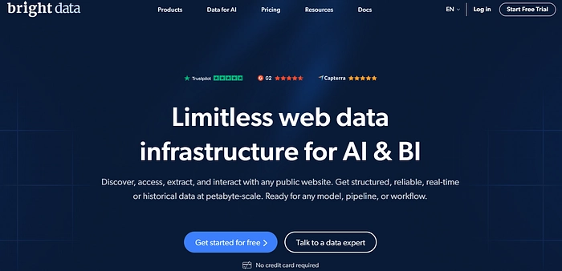
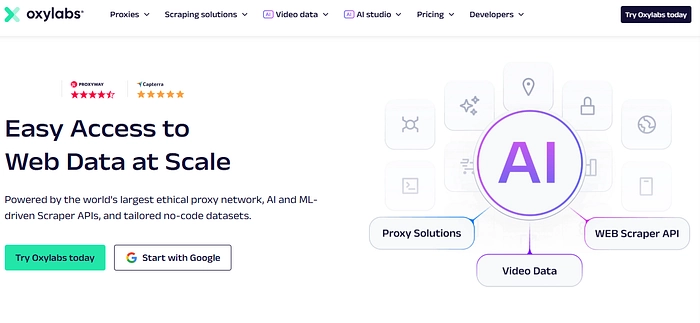
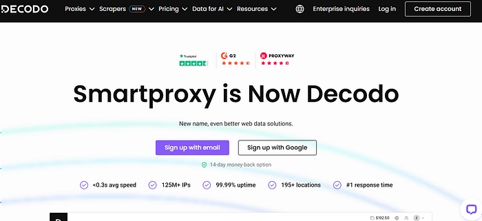
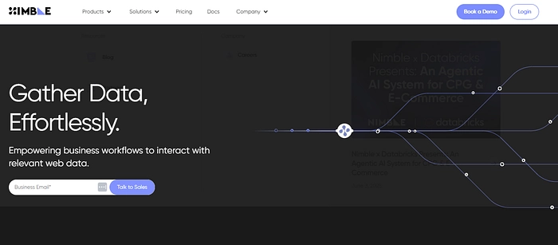
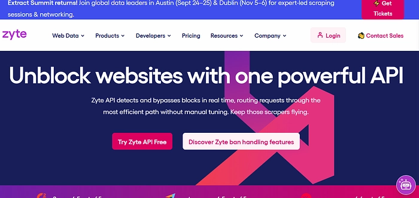
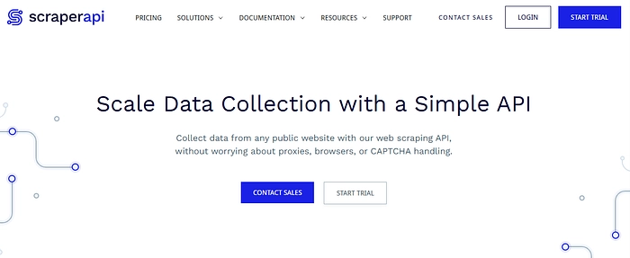
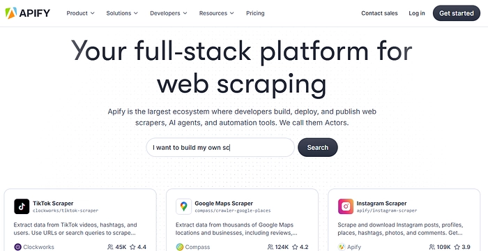

# 2025年最值得用的YouTube数据采集工具

老实说，从YouTube抓数据从来都不是件轻松活儿。平台限制多，IP容易被封，一不小心就得从头来过。好在现在有不少靠谱的工具能帮开发者、营销人和研究员们省下大把时间和精力。

这篇文章会带你看看2025年最好用的YouTube采集工具——不吹不黑，只谈功能、价格和实际体验，帮你找到真正适合自己的那一款。

---

## 快速选择指南

- **Bright Data** — 大规模项目首选，稳定性和扩展性都在线
- **Oxylabs** — 企业级基础设施，适合高并发场景
- **Decodo** — 性价比之王,24/7客服随时在线
- **Nimbleway** — AI加持的智能采集，交付方式灵活
- **Zyte** — 通用型API，不只能抓YouTube
- **ScraperAPI** — 开发者友好，自动轮换代理和重试
- **Apify** — 零代码平台，模板开箱即用

---

## 七大YouTube采集工具详解

### Bright Data

Bright Data在网页采集领域算是老大哥了。他们家最厉害的就是那个庞大的代理网络——基本上不用担心被封IP的问题。

专门针对YouTube的API覆盖得很全：视频元数据、评论、字幕转录都能抓。如果你不想自己搭采集器，还能直接买他们预处理好的数据集。

界面设计得挺友好，不写代码也能上手。对于需要持续大规模采集的项目来说，Bright Data的稳定性和技术支持确实值得信赖。

**优点：**
- 代理支持强大，速度快不卡顿
- 数据覆盖全面，包括视频详情和评论区
- 界面可定制，操作简单
- 客服响应快，问题解决得利索

**缺点：**
- 价格偏高，小型项目可能吃不消
- 高级功能需要一定技术基础

**价格：**
- YouTube数据集：500美元/20万条记录（每千条2.5美元）
- 网页采集API：每千条记录1.5美元

👉 [想找更灵活的采集方案？试试这个开发者都在用的工具](https://www.scraperapi.com/?fp_ref=coupons)

---

### Oxylabs

Oxylabs走的是高端路线，主要服务大型企业。他们的YouTube采集API功能很完整：视频数据、评论、搜索结果、转录文本都能拿到。

有个挺有意思的功能——能识别视频是否可以用来训练AI模型。对搞机器学习的团队来说，这个功能能省不少筛选时间。

提供实时和批量两种交付方式，基础设施扛得住高并发请求。24/7技术支持随时在线，还有免费试用额度可以测试。

**优点：**
- 对AI训练场景友好
- 基础设施稳定，适合大项目
- 客服质量高，全天候响应
- 有免费试用

**缺点：**
- 定价偏贵，小项目不划算
- 配置过程对新手不太友好

**价格：**
起步价49美元/24,500条结果（每千条2美元）

---

### Decodo (Smartproxy)

Decodo是Smartproxy旗下的产品，主打一个"平价好用"。性能不差，价格实在，特别适合预算有限的小团队和个人开发者。

提供通用API和站点解锁器两种方案，应对YouTube的各种限制措施。不管是简单的元数据提取还是复杂点的任务，都能搞定。

客服是24小时在线聊天那种，遇到问题能马上解决。整体来说，Decodo在性价比这块确实做得不错。

**优点：**
- 价格亲民，小项目也负担得起
- 客服响应快，有在线聊天
- 配置简单，非技术人员也能上手

**缺点：**
- 高级功能相对少一些
- 定制化程度不如高端产品

**价格：**
- 网页采集API：29美元/10万请求（每千次0.29美元）
- 站点解锁器：34美元/1.5万请求

---

### Nimbleway

Nimbleway最大的卖点是AI加持。他们的AI会分析HTML结构，自动检测和修复采集过程中的错误，数据准确度比传统方法高不少。

支持实时、云端和推拉三种交付模式，适应不同场景需求。一次能处理1000个批量请求，对大型项目来说很实用。

如果你需要高精度的数据，又希望采集过程足够智能化，Nimbleway是个不错的选择。

**优点：**
- AI驱动，准确率高效率好
- 多种交付方式，灵活度高
- 处理大规模任务能力强

**缺点：**
- 大批量采集价格偏高
- 需要一定技术背景才能发挥全部功能

**价格：**
起步价每千次请求3美元，或按月度积分套餐计费

---

### Zyte

Zyte（之前叫Crawlera）是个通用型采集工具，不只能抓YouTube，几乎所有网站都能搞定。如果你需要从多个平台采集数据，Zyte会是个省心的选择。

他们的API对动态内容支持得很好，YouTube这种JavaScript重度渲染的网站也不在话下。

定价模式比较灵活，按实际使用量计费，用多少付多少。地理位置定向功能做得不错，适合需要采集特定地区数据的场景。

**优点：**
- 按需计费，成本可控
- 地理位置支持强大
- API功能完整，支持JavaScript和自定义会话

**缺点：**
- YouTube专项功能不如专用工具丰富
- 新手需要一些学习时间

**价格：**
根据使用量和功能需求定制报价

👉 [需要更简单的API接入方案？这个工具可能更适合你](https://www.scraperapi.com/?fp_ref=coupons)

---

### ScraperAPI

ScraperAPI是专门给开发者设计的，支持Python、PHP、NodeJS、Ruby、Java等主流语言。

最省心的是代理轮换、重试和会话管理都是自动的——你只管发请求，它帮你处理那些烦人的IP封禁和验证码问题。

文档写得很详细，上手快。有免费套餐可以先试用，觉得合适再升级付费计划。

唯一的问题是没有YouTube专用解析器，需要自己写点代码处理数据。但对开发者来说，这点工作量不算什么。

**优点：**
- 集成简单，主流语言都支持
- 代理轮换和重试机制可靠
- 文档完善，示例代码丰富

**缺点：**
- 没有现成的YouTube解析器
- 大量采集时费用会累积得比较快

**价格：**
起步套餐49美元/10万API积分

---

### Apify

Apify最大的特点是零代码——完全不用写程序就能抓YouTube数据。平台提供了现成的YouTube采集模板，点几下鼠标就能提取视频详情、评论和播放列表。

操作界面是那种拖拽式的，任何人都能上手。高级用户也能修改模板或定制新的采集逻辑。

支持定时任务和完成通知，可以设置好让它自动跑。数据能导出成JSON、CSV或Excel格式。

对小规模项目或者不想折腾代码的人来说，Apify是个很实用的选择。

**优点：**
- 零代码方案，界面友好
- 适合小型YouTube采集任务
- 支持定时运行和通知提醒

**缺点：**
- 大型或复杂项目灵活性不足
- 大规模采集需要配住宅代理

**价格：**
月付套餐49美元起，包含49美元平台积分和30个共享数据中心代理

---

## 写在最后

YouTube数据采集的需求越来越大，选对工具能省下大量时间和精力。Bright Data在功能和性能上确实领先，Oxylabs和Decodo紧随其后各有优势。Nimbleway的AI驱动方案和Zyte的通用性也都值得考虑。

选工具的时候，重点看价格、易用性、扩展能力和你实际需要的功能。不管你是做营销、搞研究还是写代码，总有一款适合你的YouTube采集工具。

对了，如果你需要稳定可靠的代理服务和自动化采集方案，ScraperAPI在开发者圈子里口碑一直不错——自动处理代理轮换、支持多种编程语言、文档完善，[值得一试](https://www.scraperapi.com/?fp_ref=coupons)。
